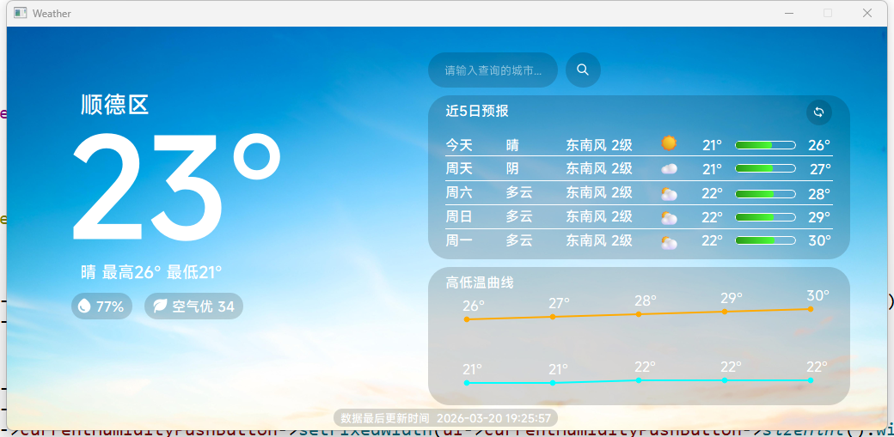
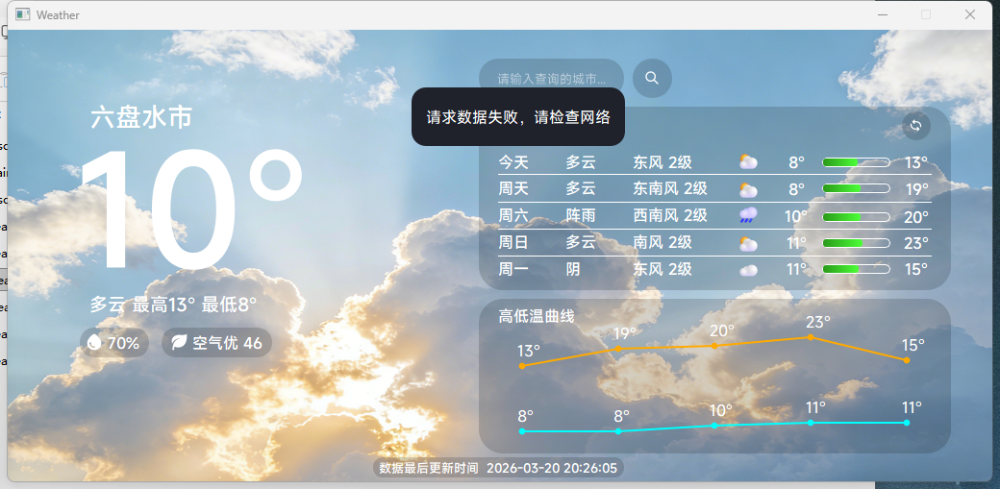
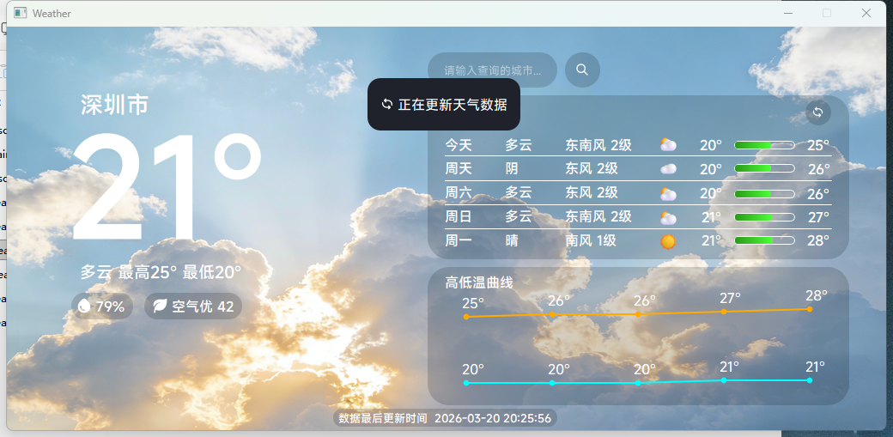

# 🌤️ WeatherQt

一个基于 Qt 开发的桌面天气应用，支持实时天气查询、多日预报展示以及温度曲线可视化。

---

## 📌 项目简介

WeatherQt 是一个使用 Qt（C++）开发的桌面天气应用，通过调用天气 API 获取实时天气数据，并进行可视化展示。

---

## ✨ 功能特性

* 🌍 城市天气查询
* 📅 多日天气预报
* 🌡️ 温度变化曲线（QPainter 绘制）
* 💨 空气质量 AQI 显示
* 🕒 实时数据更新时间显示
* 🔍 支持城市搜索

---

## 🖼️ 界面预览






---

## 🛠️ 技术栈

* C++
* Qt Widgets
* QJson（JSON解析）
* QPainter（图表绘制）
* 网络API（天气数据接口）

---

## 📂 项目结构

```
WeatherQt/
├── main.cpp
├── resources.qrc
├── weather.cpp
├── weather.h
├── Weather.pro
├── weather.ui
├── weatherData.h
├── screenshot/
├── resources/
└── README.md
```

---

## ⚙️ 运行环境

* Qt 5.12+
* C++11 及以上
* Windows / Linux

---

## 🚀 编译运行

### Qt Creator 方式

1. 打开 Qt Creator
2. 打开 `.pro` 工程文件
3. 构建并运行项目

---

### 命令行方式

```bash
qmake
make
./WeatherQt
```

---

## 🔑 API 配置

本项目依赖天气 API，请自行申请 Key。

在代码中配置：

```cpp
QString apiKey = "你的API_KEY";
```

---

## ⚠️ 已知问题

* 如果windows上，则无需关注输入法问题；如果是用于嵌入式设备，请自行编译适合的输入法来输入城市名（需设置 `QT_IM_MODULE`）
* UI 适配仍有优化空间

---

## 📄 使用前须知

项目可能存在还未显露的问题，不建议作为主力使用。若该项目的程序造成的设备损坏等问题，作者概不负责。 项目仅限于交流学习，禁止用于商业目的，违者产生的后果，作者概不负责任。照片素材来源于互联网，如有侵犯，请联系项目作者进行删除。

---

## 👨‍💻 作者

KD
